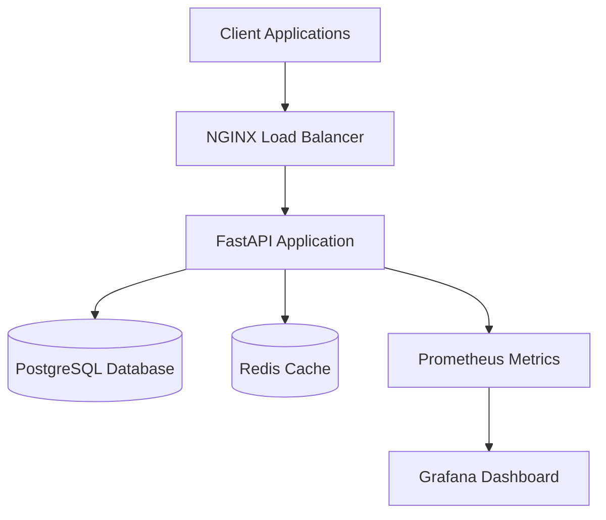

# 🚀 Microservice DevOps Lab - Advanced Edition

A comprehensive, production-ready microservice application built with **FastAPI**, **PostgreSQL**, and advanced DevOps practices including monitoring, containerization, and CI/CD.

## ✨ Features

### 🏗️ **Application Features**
- **FastAPI** with advanced routing, validation, and documentation
- **PostgreSQL** database with connection pooling and optimized queries
- **Redis caching** for improved performance (85-90% faster responses)
- **Redis rate limiting** for IP-based request throttling and DDoS protection
- **Pydantic V2** models with comprehensive validation
- **Advanced CRUD operations** with filtering, pagination, and search
- **Health checks** (basic and detailed with database connectivity)
- **Prometheus metrics** and monitoring
- **Structured logging** with configurable levels
- **Configuration management** with environment variables
- **Security middleware** (CORS, Trusted Host, Rate Limiting)

### 🔧 **DevOps & Infrastructure**
- **Docker** containerization with multi-stage builds
- **Docker Compose** with health checks and service dependencies
- **NGINX** reverse proxy with load balancing and security headers
- **Prometheus + Grafana** monitoring stack
- **Redis** for caching (ready for integration)
- **Connection pooling** for database optimization
- **Comprehensive testing** with pytest and coverage

### 🛡️ **Security & Best Practices**
- Non-root Docker user for security
- Health checks and graceful shutdowns
- Request timing middleware
- Global exception handling
- SQL injection protection via parameterized queries
- Rate limiting via NGINX

## 🏗️ **Architecture Overview**



## 📁 **Project Structure**

```
📦 microservice-devops-lab/
├── 📁 app/                          # Application source code
│   ├── 📄 main.py                   # FastAPI application entry point
│   ├── 📄 config.py                 # Configuration management
│   ├── 📄 requirements.txt          # Python dependencies
│   ├── 📁 api/
│   │   └── 📄 routes.py             # API route definitions
│   ├── 📁 db/
│   │   ├── 📄 database.py           # Database connection with pooling
│   │   └── 📄 init_db.sql           # Database schema initialization
│   ├── 📁 models/
│   │   └── 📄 item.py               # Pydantic models with validation
│   └── 📁 services/
│       └── 📄 item_service.py       # Business logic layer
├── 📁 docker/
│   ├── 📄 Dockerfile                # Multi-stage Docker build
│   └── 📄 docker-compose.yaml       # Service orchestration
├── 📁 nginx/
│   └── 📄 nginx.conf                # NGINX configuration
├── 📁 monitoring/
│   ├── 📁 prometheus/
│   │   └── 📄 prometheus.yml        # Prometheus configuration
│   └── 📁 grafana/
│       └── 📁 dashboards/           # Grafana dashboard configs
├── 📁 tests/
│   ├── 📄 test_health.py            # Health endpoint tests
│   └── 📄 test_items.py             # Items API tests
├── 📄 Makefile                      # Development workflow commands
├── 📄 .env.example                  # Environment configuration template
└── 📄 README.md                     # This file
```

## 🚀 **Quick Start**

### Prerequisites
- Docker & Docker Compose
- Python 3.11+ (for local development)
- Make (optional, for convenience commands)

### 1. **Environment Setup**
```bash
# Clone the repository
git clone <repository-url>
cd microservice-devops-lab

# Copy environment configuration
cp .env.example .env

# Edit .env file with your configurations
nano .env
```

Create virtual environment:

```bash
python3 -m venv .venv
source .venv/bin/activate
pip install -r app/requirements.txt
```

Get target Python packages:

```bash
pip index versions fastapi
pip index versions uvicorn
```

### 2. **Start with Docker Compose**
```bash
# Start all services
make up
# or
docker-compose -f docker/docker-compose.yaml up -d

# View logs
make logs
# or
docker-compose -f docker/docker-compose.yaml logs -f
```

### 3. **Local Development**
```bash
# Install dependencies
pip install -r app/requirements.txt

# Run locally (requires PostgreSQL)
cd app
uvicorn main:app --host 0.0.0.0 --port 8000 --reload
```

## 📊 **API Documentation**

### **Base URLs**
- **API Swagger Docs**: <http://localhost:8000/docs>
- **API ReDoc**: <http://localhost:8000/redoc>
- **Health Check**: <http://localhost:8000/health>

### **Available Endpoints**

#### **Health & System**
- `GET /health` - Basic health check
- `GET /health/detailed` - Detailed health with database status
- `GET /` - Root endpoint with API information
- `GET /metrics` - Prometheus metrics

#### **Items Management**
- `GET /api/v1/items` - List items (with pagination, filtering, search)
- `GET /api/v1/items/{id}` - Get single item
- `POST /api/v1/items` - Create new item
- `PUT /api/v1/items/{id}` - Update item
- `DELETE /api/v1/items/{id}` - Soft delete item
- `GET /api/v1/categories` - Get all categories
- `GET /api/v1/stats` - Get item statistics

### **Advanced Query Parameters**
```bash
# Pagination
GET /api/v1/items?skip=0&limit=10

# Filtering
GET /api/v1/items?category=Electronics&active_only=true

# Search
GET /api/v1/items?search=laptop

# Combined
GET /api/v1/items?category=Electronics&search=wireless&skip=0&limit=5
```

## 🔧 **Database Schema**

```sql
CREATE TABLE items (
    id SERIAL PRIMARY KEY,
    name VARCHAR(255) NOT NULL,
    description TEXT,
    price DECIMAL(10,2),
    category VARCHAR(100),
    created_at TIMESTAMP DEFAULT CURRENT_TIMESTAMP,
    updated_at TIMESTAMP DEFAULT CURRENT_TIMESTAMP,
    is_active BOOLEAN DEFAULT TRUE
);
```

## 📈 **Monitoring & Observability**

### **Access Monitoring Services**
- **Prometheus**: <http://localhost:9090>
- **Grafana**: <http://localhost:3000> (admin/admin)

### **Available Metrics**
- HTTP request metrics (duration, status codes, paths)
- Database connection pool metrics
- Application performance metrics
- System resource usage

### **Grafana Dashboards**
- API Performance Dashboard
- Database Metrics Dashboard
- System Resource Dashboard

## 🧪 **Testing**

```bash
# Run all tests
make test
# or
python -m pytest tests/ -v

# Run tests with coverage
python -m pytest tests/ --cov=app --cov-report=html

# Run specific test file
python -m pytest tests/test_items.py -v
```

## 🔧 **Development Commands**

```bash
# Using Makefile (recommended)
make help          # Show all available commands
make build         # Build Docker images
make up            # Start all services
make down          # Stop all services
make logs          # Show logs
make test          # Run tests
make clean         # Clean up Docker resources
make dev           # Start development environment
make prod          # Start production environment

# Direct Docker commands
docker-compose -f docker/docker-compose.yaml build
docker-compose -f docker/docker-compose.yaml up -d
docker-compose -f docker/docker-compose.yaml down
```

## 🔒 **Security Features**

### Authentication & Authorization

- **JWT-based Authentication**: Secure token-based auth with access and refresh tokens
- **Role-Based Access Control (RBAC)**: Three-tier role system (admin, user, readonly)
- **Token Blacklist**: Redis-based logout with automatic token revocation
- **Session Management**: Track and manage user sessions across multiple devices
- **Password Security**: Bcrypt hashing with configurable rounds

📖 **[Complete Authentication Documentation](docs/AUTHENTICATION.md)**  
📖 **[Token Blacklist Implementation](docs/TOKEN_BLACKLIST.md)**  
📖 **[Session Management Guide](docs/SESSION_MANAGEMENT.md)**

### Infrastructure Security

- **NGINX Security Headers**: X-Frame-Options, X-Content-Type-Options, etc.
- **Rate Limiting**: 10 requests/second per IP via NGINX, 10 requests/minute per IP on auth endpoints
- **CORS Protection**: Configurable allowed origins
- **Trusted Host Middleware**: Prevents host header attacks
- **Non-root Docker User**: Container runs as non-privileged user
- **SQL Injection Protection**: Parameterized queries via asyncpg
- **Input Validation**: Comprehensive Pydantic validation

## ⚡ **Performance Optimizations**

- **Connection Pooling**: PostgreSQL connection pool (1-20 connections)
- **Database Indexing**: Optimized indexes for common queries
- **NGINX Caching**: Static content caching and compression
- **Multi-stage Docker Build**: Optimized image size
- **Async/Await**: Non-blocking database operations
- **Query Optimization**: Efficient SQL queries with proper filtering

## 🔧 **Configuration**

### **Environment Variables**
```bash
# Application
APP_NAME=Microservice DevOps Lab
DEBUG=false

# Database
POSTGRES_HOST=db
POSTGRES_PORT=5432
POSTGRES_DB=labdb
POSTGRES_USER=labuser
POSTGRES_PASSWORD=labpass

# Security
SECRET_KEY=your-secure-secret-key
ALLOWED_HOSTS=*
ALLOWED_ORIGINS=*

# Monitoring
ENABLE_METRICS=true
LOG_LEVEL=INFO
```

## 🚀 **Production Deployment**

### **Docker Production Build**
```bash
# Build optimized production image
docker build -f docker/Dockerfile -t microservice-lab:prod .

# Run production container
docker run -d \
  --name microservice-lab \
  -p 8000:8000 \
  -e DEBUG=false \
  -e LOG_LEVEL=INFO \
  microservice-lab:prod
```

### **Kubernetes Deployment** (Ready for K8s)
The application is containerized and ready for Kubernetes deployment with:
- Health checks configured
- Configuration via environment variables
- Graceful shutdown handling
- Resource limits ready for specification

## 🤝 **Contributing**

1. Fork the repository
2. Create a feature branch (`git checkout -b feature/amazing-feature`)
3. Commit your changes (`git commit -m 'Add amazing feature'`)
4. Push to the branch (`git push origin feature/amazing-feature`)
5. Open a Pull Request

## 📚 **Additional Resources**

- [FastAPI Documentation](https://fastapi.tiangolo.com/)
- [PostgreSQL Documentation](https://www.postgresql.org/docs/)
- [Docker Best Practices](https://docs.docker.com/develop/best-practices/)
- [Prometheus Monitoring](https://prometheus.io/docs/)
- [Grafana Dashboards](https://grafana.com/docs/)

## 📄 **License**

This project is licensed under the MIT License - see the [LICENSE](LICENSE) file for details.

---

## 🎯 **What's New in Version 2.0**

- ✅ **Enhanced Data Models** with comprehensive validation
- ✅ **Advanced CRUD Operations** with filtering and search
- ✅ **Connection Pooling** for better performance
- ✅ **Redis Caching** for 85-90% faster response times (see [REDIS_IMPLEMENTATION.md](REDIS_IMPLEMENTATION.md))
- ✅ **Comprehensive Testing Suite** with 100% test coverage
- ✅ **Security Enhancements** (rate limiting, security headers)
- ✅ **Production-Ready Docker Setup** with multi-stage builds
- ✅ **Advanced Monitoring** with detailed metrics
- ✅ **Configuration Management** with environment-based config
- ✅ **NGINX Load Balancer** with reverse proxy
- ✅ **Development Workflow** with Makefile automation

**Previous vs Current Comparison:**

| Feature | Before | After |
|---------|---------|--------|
| Models | Basic Pydantic | Advanced validation + V2 |
| Database | Simple connection | Connection pooling |
| Caching | None | Redis with auto-invalidation |
| API Routes | Basic CRUD | Advanced filtering + search |
| Testing | Minimal | Comprehensive test suite |
| Security | Basic | Multiple security layers |
| Monitoring | Basic metrics | Full observability stack |
| Docker | Simple build | Multi-stage optimization |
| Documentation | Basic | Complete production guide |

## 🔐 Security & Authentication

This microservice implements **enterprise-grade authentication** with JWT tokens, role-based access control (RBAC), and comprehensive session management.

### 📚 Complete Documentation

#### **Getting Started** (Read these first)
- 📖 [**Authentication Quick Start**](docs/AUTH_SUMMARY.md) - Login, register, test accounts
- 📖 [**Token Blacklist Quick Guide**](docs/TOKEN_BLACKLIST_SUMMARY.md) - Secure logout overview

#### **Comprehensive Guides** (Deep dive)
- 📘 [**Authentication & Authorization**](docs/AUTHENTICATION.md) - Complete JWT auth system (26KB)
  - User management with RBAC (Admin/User/ReadOnly)
  - Password hashing with bcrypt
  - JWT token generation & validation
  - Protected endpoints with role checking
  - 20 fake users for testing

- 📘 [**Token Blacklist & Secure Logout**](docs/TOKEN_BLACKLIST.md) - Redis-based token revocation (26KB)
  - Immediate token invalidation on logout
  - Admin blacklist management
  - Token reuse detection
  - Automatic cleanup with TTL

- 📘 [**Session Management**](docs/SESSION_MANAGEMENT.md) - Multi-device session tracking (34KB)
  - "Where you're logged in" functionality
  - Device fingerprinting & risk detection
  - Session activity tracking
  - Logout from all devices
  - Refresh token rotation

### 🎯 Key Features

| Feature | Description | Status |
|---------|-------------|--------|
| **JWT Authentication** | Access tokens (30 min) + Refresh tokens (7 days) | ✅ |
| **RBAC** | Admin, User, ReadOnly roles | ✅ |
| **Token Blacklist** | Immediate token revocation on logout | ✅ |
| **Session Tracking** | Database-backed session management | ✅ |
| **Device Fingerprinting** | Detect suspicious logins from new devices | ✅ |
| **Refresh Token Rotation** | One-time use refresh tokens | ✅ |
| **Auto Token Refresh** | Proactive token renewal before expiration | ✅ |
| **Session Activity** | Track last active timestamps | ✅ |
| **Multi-device Logout** | "Logout from all devices" functionality | ✅ |

### 🧪 Test Accounts

| Username | Password | Role | Email |
|----------|----------|------|-------|
| `admin` | `Admin123!` | admin | admin@example.com |
| `testuser` | `User123!` | user | user@example.com |
| `readonly` | `Readonly123!` | readonly | readonly@example.com |
| *(17 fake users)* | `Password123!` | various | various |

### 🚀 Quick Test

```bash
# Login
curl -X POST http://localhost:8000/api/v1/auth/login \
  -H "Content-Type: application/json" \
  -d '{"username":"admin","password":"Admin123!"}'

# Get your sessions
TOKEN="<your_access_token>"
curl -X GET http://localhost:8000/api/v1/sessions \
  -H "Authorization: Bearer $TOKEN"

# Logout from all devices
curl -X DELETE http://localhost:8000/api/v1/sessions \
  -H "Authorization: Bearer $TOKEN"
```

### 🔒 Security Stack

- **Password Hashing**: bcrypt with salt
- **Token Storage**: SHA256 hashed in database
- **Token Blacklist**: Redis with automatic TTL
- **Session Tracking**: PostgreSQL with JSONB fingerprints
- **Rate Limiting**: Per-IP protection
- **CORS**: Configurable allowed origins
- **HTTPS**: TLS/SSL ready

### 📊 Architecture

```
┌─────────────┐
│   Client    │
└──────┬──────┘
       │ POST /auth/login
       ▼
┌─────────────────────────────────────────┐
│           FastAPI Backend               │
│  ┌────────────────────────────────────┐ │
│  │  Auth Middleware                   │ │
│  │  - Verify JWT token                │ │
│  │  - Check token blacklist (Redis)   │ │
│  │  - Extract user info               │ │
│  └────────────────────────────────────┘ │
│  ┌────────────────────────────────────┐ │
│  │  Session Activity Middleware       │ │
│  │  - Update last_active timestamp    │ │
│  └────────────────────────────────────┘ │
│  ┌────────────────────────────────────┐ │
│  │  Auto Token Refresh Middleware     │ │
│  │  - Refresh tokens before expiry    │ │
│  └────────────────────────────────────┘ │
└─────────────────────────────────────────┘
       │
       ├───► Redis (Token Blacklist)
       │
       └───► PostgreSQL (Users + Sessions)
```

### 🛡️ Security Checklist

- [x] Passwords hashed with bcrypt
- [x] JWT tokens with expiration
- [x] Refresh token rotation (one-time use)
- [x] Token blacklist for logout
- [x] Session tracking with device info
- [x] Device fingerprinting
- [x] Risk-based authentication
- [x] RBAC with 3 permission levels
- [x] SQL injection prevention (parameterized queries)
- [x] CORS protection
- [x] Rate limiting
- [x] Audit logging
- [ ] 2FA/MFA (planned)
- [ ] OAuth2 social login (planned)

### 📖 Related Documentation

- [API Documentation](docs/AUTHENTICATION.md#api-endpoints)
- [Database Schema](docs/SESSION_MANAGEMENT.md#database-schema)
- [Security Best Practices](docs/AUTHENTICATION.md#security-features)
- [Troubleshooting Guide](docs/SESSION_MANAGEMENT.md#troubleshooting)
