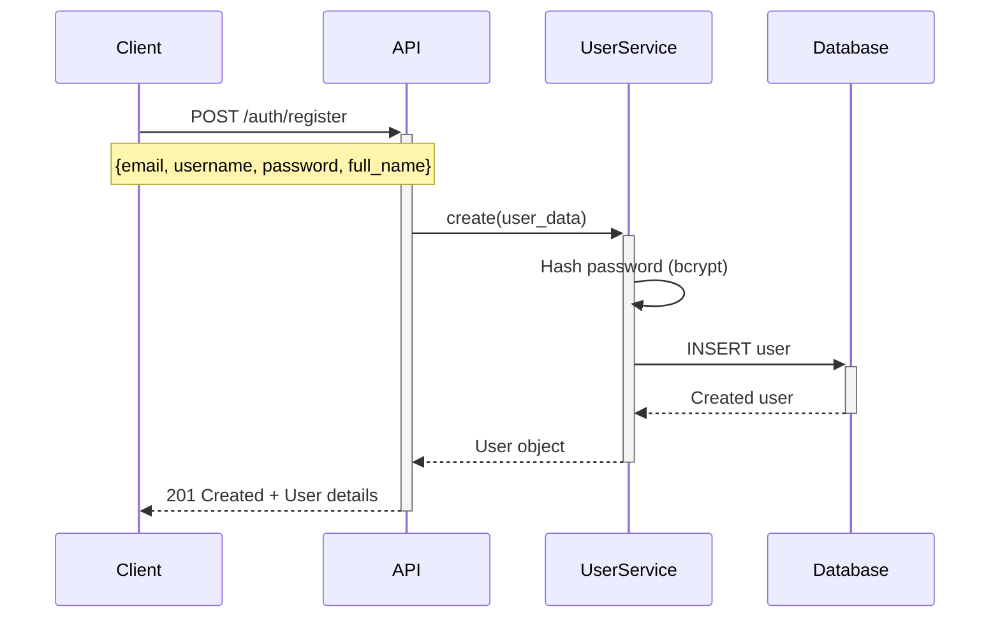
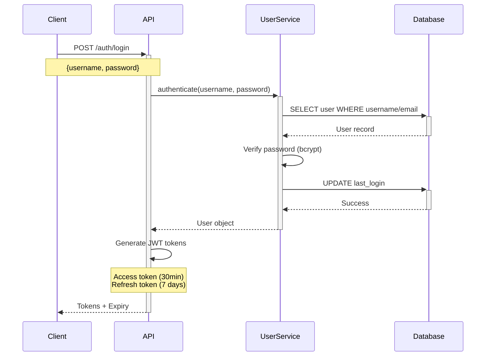
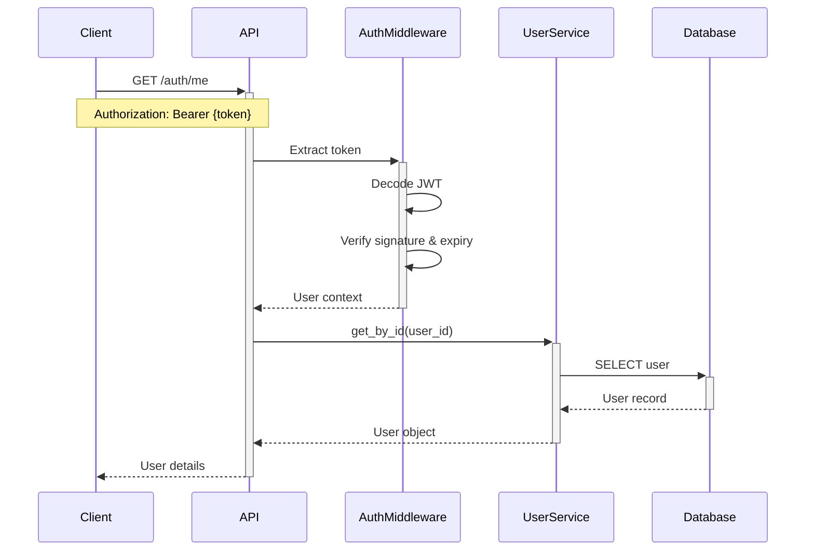
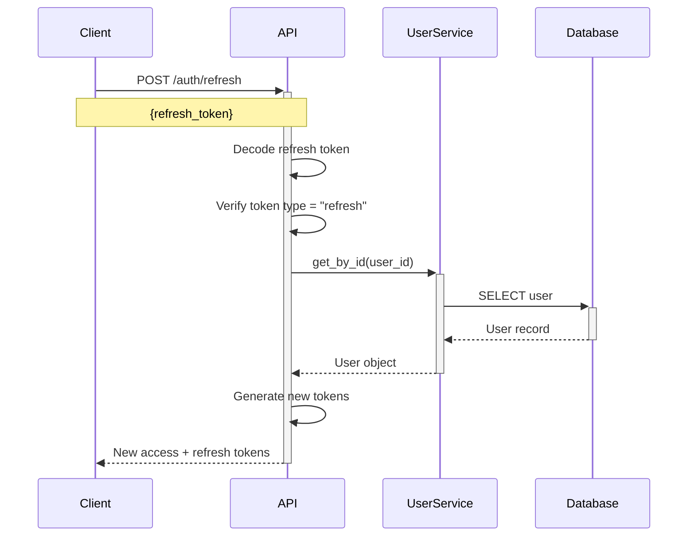

# Authentication & Authorization Documentation

## Overview

This microservice implements a comprehensive JWT-based authentication and authorization system with role-based access control (RBAC). The system provides secure user management, token-based authentication, and fine-grained permission control.

## Table of Contents

- [Architecture](#architecture)
- [Authentication Flow](#authentication-flow)
- [Authorization (RBAC)](#authorization-rbac)
- [Security Features](#security-features)
- [API Endpoints](#api-endpoints)
- [User Management](#user-management)
- [Configuration](#configuration)
- [Testing](#testing)
- [Troubleshooting](#troubleshooting)

---

## Architecture

### Technology Stack

- **FastAPI**: Web framework with automatic OpenAPI documentation
- **JWT (JSON Web Tokens)**: Stateless authentication using python-jose
- **Bcrypt**: Password hashing via passlib
- **PostgreSQL**: User data persistence with asyncpg driver
- **Redis**: Token blacklist and session management (optional)
- **Pydantic**: Data validation and serialization

### Components

```
┌─────────────────────────────────────────────────────────────┐
│                      Client Application                      │
└────────────────────────┬────────────────────────────────────┘
                         │ HTTP + JWT Token
                         ▼
┌─────────────────────────────────────────────────────────────┐
│                     FastAPI Application                      │
│  ┌──────────────┐  ┌──────────────┐  ┌──────────────┐      │
│  │ Auth Routes  │  │ User Routes  │  │    Other     │      │
│  │  /auth/*     │  │  /users/*    │  │   Routes     │      │
│  └──────┬───────┘  └──────┬───────┘  └──────┬───────┘      │
│         │                  │                  │              │
│         ▼                  ▼                  ▼              │
│  ┌────────────────────────────────────────────────────┐     │
│  │          Authentication Middleware                 │     │
│  │  - Token validation                                │     │
│  │  - User extraction                                 │     │
│  │  - Role verification                               │     │
│  └────────────────────┬───────────────────────────────┘     │
│                       │                                      │
│                       ▼                                      │
│  ┌────────────────────────────────────────────────────┐     │
│  │              Core Auth Module                      │     │
│  │  - JWT creation/verification                       │     │
│  │  - Password hashing/verification                   │     │
│  │  - Permission checking (RBAC)                      │     │
│  └────────────────────┬───────────────────────────────┘     │
│                       │                                      │
│                       ▼                                      │
│  ┌────────────────────────────────────────────────────┐     │
│  │              User Service                          │     │
│  │  - User CRUD operations                            │     │
│  │  - Authentication logic                            │     │
│  │  - Business rules                                  │     │
│  └────────────────────┬───────────────────────────────┘     │
└────────────────────────┼────────────────────────────────────┘
                         │
                         ▼
┌─────────────────────────────────────────────────────────────┐
│                    PostgreSQL Database                       │
│  ┌────────────────────────────────────────────────────┐     │
│  │                 users Table                        │     │
│  │  - id, email, username, password_hash              │     │
│  │  - role, is_active, is_verified                    │     │
│  │  - timestamps                                      │     │
│  └────────────────────────────────────────────────────┘     │
└─────────────────────────────────────────────────────────────┘
```

---

## Authentication Flow

### 1. User Registration



**Request:**
```json
{
  "email": "user@example.com",
  "username": "newuser",
  "password": "SecurePass123!",
  "full_name": "John Doe",
  "role": "user"
}
```

**Response:**
```json
{
  "id": 5,
  "email": "user@example.com",
  "username": "newuser",
  "full_name": "John Doe",
  "role": "user",
  "is_active": true,
  "is_verified": false,
  "created_at": "2025-11-20T18:30:00Z",
  "updated_at": "2025-11-20T18:30:00Z"
}
```

### 2. User Login



**Request:**
```json
{
  "username": "admin",
  "password": "Admin123!"
}
```

**Response:**
```json
{
  "access_token": "eyJhbGciOiJIUzI1NiIsInR5cCI6IkpXVCJ9...",
  "refresh_token": "eyJhbGciOiJIUzI1NiIsInR5cCI6IkpXVCJ9...",
  "token_type": "bearer",
  "expires_in": 1800
}
```

### 3. Authenticated Request



### 4. Token Refresh



---

## Authorization (RBAC)

### User Roles

The system supports three role levels:

| Role | Level | Permissions |
|------|-------|-------------|
| **admin** | 3 | Full system access, user management, all CRUD operations |
| **user** | 2 | Standard user operations, own data management |
| **readonly** | 1 | Read-only access, cannot modify data |

### Role Hierarchy

```
admin (highest)
  │
  ├── Can do everything user can do
  ├── Can manage other users
  ├── Can access admin-only endpoints
  └── Can modify system settings
  
user
  │
  ├── Can do everything readonly can do
  ├── Can create/update own resources
  └── Can change own profile
  
readonly (lowest)
  │
  ├── Can view public data
  └── Cannot modify any data
```

### Permission Checking

**Implementation (`app/core/permissions.py`):**

```python
from fastapi import HTTPException, Depends, status
from models.user import UserRole

class RoleChecker:
    def __init__(self, allowed_roles: list[UserRole]):
        self.allowed_roles = allowed_roles
    
    def __call__(self, current_user: dict):
        user_role = current_user.get("role")
        
        # Admin bypass - admins can access everything
        if user_role == "admin":
            return current_user
        
        # Check if user's role is in allowed roles
        if user_role not in [role.value for role in self.allowed_roles]:
            raise HTTPException(
                status_code=status.HTTP_403_FORBIDDEN,
                detail=f"Insufficient permissions. Required role: {self.allowed_roles}"
            )
        
        return current_user

# Pre-configured role checkers
require_admin = RoleChecker([UserRole.ADMIN])
require_user = RoleChecker([UserRole.USER, UserRole.ADMIN])
require_readonly = RoleChecker([UserRole.READONLY, UserRole.USER, UserRole.ADMIN])
```

**Usage in Routes:**

```python
from core.permissions import require_admin

@router.get("/users", dependencies=[Depends(require_admin)])
async def list_users():
    """Only admins can list all users"""
    pass

@router.delete("/users/{user_id}", dependencies=[Depends(require_admin)])
async def delete_user(user_id: int):
    """Only admins can delete users"""
    pass
```

---

## Security Features

### 1. Password Security

- **Hashing Algorithm**: Bcrypt (via passlib)
- **Salt Rounds**: Automatic (default: 12)
- **Password Requirements**:
  - Minimum 8 characters
  - At least 1 uppercase letter
  - At least 1 lowercase letter
  - At least 1 digit
  - Special characters recommended

```python
from passlib.context import CryptContext

pwd_context = CryptContext(schemes=["bcrypt"], deprecated="auto")

def get_password_hash(password: str) -> str:
    return pwd_context.hash(password)

def verify_password(plain_password: str, hashed_password: str) -> bool:
    return pwd_context.verify(plain_password, hashed_password)
```

### 2. JWT Token Security

**Access Token:**
- **Lifetime**: 30 minutes
- **Algorithm**: HS256 (HMAC with SHA-256)
- **Claims**: sub (user_id), email, username, role, full_name, exp, iat, type
- **Purpose**: API access authentication

**Refresh Token:**
- **Lifetime**: 7 days
- **Algorithm**: HS256
- **Claims**: sub (user_id), email, exp, iat, type
- **Purpose**: Renewing access tokens without re-authentication

**Security Measures:**
- Secret key stored in environment variables
- Token expiration validation
- Token type verification (access vs refresh)
- Signature validation on every request

### 3. Rate Limiting

Rate limiting is implemented to prevent brute-force attacks:

```python
# Configuration in main.py
- 10 requests per minute per IP
- 60-second block duration
- Applied globally to all endpoints
```

### 4. Input Validation

All inputs are validated using Pydantic models:

```python
from pydantic import BaseModel, EmailStr, Field, validator

class UserCreate(BaseModel):
    email: EmailStr
    username: str = Field(min_length=3, max_length=100)
    password: str = Field(min_length=8)
    full_name: str | None = None
    role: UserRole = UserRole.USER
    
    @validator('password')
    def validate_password(cls, v):
        if not re.search(r'[A-Z]', v):
            raise ValueError('Password must contain uppercase letter')
        if not re.search(r'[a-z]', v):
            raise ValueError('Password must contain lowercase letter')
        if not re.search(r'\d', v):
            raise ValueError('Password must contain digit')
        return v
```

### 5. SQL Injection Prevention

- **Parameterized Queries**: All database queries use parameter binding
- **ORM/Query Builder**: asyncpg with proper parameter escaping
- **No String Concatenation**: User inputs never concatenated into SQL

```python
# Safe query example
query = "SELECT * FROM users WHERE email = $1"
user = await conn.fetchrow(query, email)  # Parameterized

# NEVER do this:
# query = f"SELECT * FROM users WHERE email = '{email}'"  # UNSAFE!
```

---

## API Endpoints

### Authentication Endpoints (`/api/v1/auth`)

#### POST `/auth/register`
Register a new user account.

**Request Body:**
```json
{
  "email": "user@example.com",
  "username": "newuser",
  "password": "SecurePass123!",
  "full_name": "John Doe",
  "role": "user"
}
```

**Response:** `201 Created`
```json
{
  "id": 5,
  "email": "user@example.com",
  "username": "newuser",
  "full_name": "John Doe",
  "role": "user",
  "is_active": true,
  "is_verified": false,
  "created_at": "2025-11-20T18:30:00Z"
}
```

**Errors:**
- `400 Bad Request`: Email/username already exists, invalid data
- `500 Internal Server Error`: Database error

---

#### POST `/auth/login`
Login with username/email and password.

**Request Body:**
```json
{
  "username": "admin",
  "password": "Admin123!"
}
```

**Response:** `200 OK`
```json
{
  "access_token": "eyJhbGciOiJIUzI1NiIsInR5cCI6IkpXVCJ9...",
  "refresh_token": "eyJhbGciOiJIUzI1NiIsInR5cCI6IkpXVCJ9...",
  "token_type": "bearer",
  "expires_in": 1800
}
```

**Errors:**
- `401 Unauthorized`: Invalid credentials
- `500 Internal Server Error`: Server error

---

#### POST `/auth/login/form`
OAuth2 compatible login (for Swagger UI).

**Form Data:**
- `username`: Username or email
- `password`: Password

**Response:** Same as `/auth/login`

---

#### POST `/auth/refresh`
Refresh access token using refresh token.

**Request Body:**
```json
{
  "refresh_token": "eyJhbGciOiJIUzI1NiIsInR5cCI6IkpXVCJ9..."
}
```

**Response:** `200 OK`
```json
{
  "access_token": "eyJhbGciOiJIUzI1NiIsInR5cCI6IkpXVCJ9...",
  "refresh_token": "eyJhbGciOiJIUzI1NiIsInR5cCI6IkpXVCJ9...",
  "token_type": "bearer",
  "expires_in": 1800
}
```

**Errors:**
- `401 Unauthorized`: Invalid or expired refresh token

---

#### GET `/auth/me`
Get current authenticated user information.

**Headers:**
```
Authorization: Bearer {access_token}
```

**Response:** `200 OK`
```json
{
  "id": 1,
  "email": "admin@example.com",
  "username": "admin",
  "full_name": "System Administrator",
  "role": "admin",
  "is_active": true,
  "is_verified": true,
  "last_login": "2025-11-20T18:30:00Z",
  "created_at": "2025-11-20T18:00:00Z"
}
```

**Errors:**
- `401 Unauthorized`: Invalid or missing token
- `404 Not Found`: User not found

---

#### POST `/auth/logout`
Logout current user (client-side token removal).

**Headers:**
```
Authorization: Bearer {access_token}
```

**Response:** `200 OK`
```json
{
  "message": "Successfully logged out",
  "note": "Token will remain valid until expiration. Clear token from client storage."
}
```

---

### User Management Endpoints (`/api/v1/users`)

#### GET `/users`
List all users (Admin only).

**Headers:**
```
Authorization: Bearer {admin_access_token}
```

**Query Parameters:**
- `skip`: Offset for pagination (default: 0)
- `limit`: Number of results (default: 100)
- `role`: Filter by role (admin, user, readonly)
- `is_active`: Filter by active status (true/false)

**Response:** `200 OK`
```json
[
  {
    "id": 1,
    "email": "admin@example.com",
    "username": "admin",
    "full_name": "System Administrator",
    "role": "admin",
    "is_active": true,
    "is_verified": true,
    "last_login": "2025-11-20T18:30:00Z",
    "created_at": "2025-11-20T18:00:00Z"
  }
]
```

**Errors:**
- `403 Forbidden`: Insufficient permissions (not admin)

---

#### POST `/users`
Create a new user (Admin only).

**Headers:**
```
Authorization: Bearer {admin_access_token}
```

**Request Body:**
```json
{
  "email": "newuser@example.com",
  "username": "newuser",
  "password": "SecurePass123!",
  "full_name": "New User",
  "role": "user"
}
```

**Response:** `201 Created`

---

#### GET `/users/{user_id}`
Get user by ID (Self or Admin).

**Headers:**
```
Authorization: Bearer {access_token}
```

**Response:** `200 OK`

---

#### PUT `/users/{user_id}`
Update user (Self or Admin).

**Headers:**
```
Authorization: Bearer {access_token}
```

**Request Body:**
```json
{
  "full_name": "Updated Name",
  "email": "newemail@example.com"
}
```

**Response:** `200 OK`

---

#### DELETE `/users/{user_id}`
Delete user (Admin only).

**Headers:**
```
Authorization: Bearer {admin_access_token}
```

**Response:** `204 No Content`

---

#### PUT `/users/{user_id}/password`
Change user password (Self only).

**Headers:**
```
Authorization: Bearer {access_token}
```

**Request Body:**
```json
{
  "current_password": "OldPass123!",
  "new_password": "NewSecurePass123!"
}
```

**Response:** `200 OK`

---

#### GET `/users/stats`
Get user statistics (Admin only).

**Response:** `200 OK`
```json
{
  "total_users": 20,
  "active_users": 18,
  "verified_users": 15,
  "by_role": {
    "admin": 2,
    "user": 16,
    "readonly": 2
  }
}
```

---

## User Management

### Database Schema

**Table: `users`**

```sql
CREATE TABLE users (
    id SERIAL PRIMARY KEY,
    email VARCHAR(255) UNIQUE NOT NULL,
    username VARCHAR(100) UNIQUE NOT NULL,
    full_name VARCHAR(255),
    hashed_password VARCHAR(255) NOT NULL,
    role VARCHAR(20) NOT NULL DEFAULT 'user',
    is_active BOOLEAN NOT NULL DEFAULT true,
    is_verified BOOLEAN NOT NULL DEFAULT false,
    last_login TIMESTAMP WITH TIME ZONE,
    created_at TIMESTAMP WITH TIME ZONE DEFAULT CURRENT_TIMESTAMP,
    updated_at TIMESTAMP WITH TIME ZONE DEFAULT CURRENT_TIMESTAMP
);

-- Indexes for performance
CREATE INDEX idx_users_email ON users(email);
CREATE INDEX idx_users_username ON users(username);
CREATE INDEX idx_users_role ON users(role);
CREATE INDEX idx_users_is_active ON users(is_active);
CREATE INDEX idx_users_created_at ON users(created_at);

-- Trigger for updated_at
CREATE TRIGGER update_users_updated_at
    BEFORE UPDATE ON users
    FOR EACH ROW
    EXECUTE FUNCTION update_updated_at_column();
```

### Default Users

The system creates three default users on startup:

| Username | Email | Password | Role | Purpose |
|----------|-------|----------|------|---------|
| admin | admin@example.com | Admin123! | admin | System administration |
| testuser | user@example.com | User123! | user | Testing regular user features |
| readonly | readonly@example.com | Readonly123! | readonly | Testing read-only access |

**⚠️ Security Warning:** Change default passwords in production!

### User Generator

The system includes a user generator that creates fake users for testing:

```python
from services.user_generator import UserGenerator

# Generate 20 fake users
generator = UserGenerator()
await generator.populate_users(count=20)
```

**Fake User Details:**
- Password: `Password123!` (all fake users)
- Role Distribution: 80% user, 15% readonly, 5% admin
- Random names, emails, and usernames via Faker library

---

## Configuration

### Environment Variables

```bash
# JWT Configuration
SECRET_KEY=your-super-secret-key-change-in-production
ALGORITHM=HS256
ACCESS_TOKEN_EXPIRE_MINUTES=30
REFRESH_TOKEN_EXPIRE_DAYS=7

# Database
DATABASE_URL=postgresql://labuser:labpass@db:5432/labdb

# Redis (optional)
REDIS_URL=redis://redis:6379

# Application
ENABLE_FAKE_DATA=true
FAKE_USER_COUNT=20
```

### Security Configuration

**`app/config.py`:**

```python
from pydantic_settings import BaseSettings

class Settings(BaseSettings):
    # Security
    secret_key: str = "change-me-in-production"
    algorithm: str = "HS256"
    access_token_expire_minutes: int = 30
    refresh_token_expire_days: int = 7
    
    # Rate Limiting
    rate_limit_requests: int = 10
    rate_limit_window: int = 60
    
    # Password Policy
    password_min_length: int = 8
    password_require_uppercase: bool = True
    password_require_lowercase: bool = True
    password_require_digit: bool = True
    password_require_special: bool = False
    
    class Config:
        env_file = ".env"
```

---

## Testing

### Manual Testing with cURL

#### 1. Register a New User

```bash
curl -X POST http://localhost:8000/api/v1/auth/register \
  -H "Content-Type: application/json" \
  -d '{
    "email": "test@example.com",
    "username": "testuser",
    "password": "TestPass123!",
    "full_name": "Test User"
  }'
```

#### 2. Login

```bash
curl -X POST http://localhost:8000/api/v1/auth/login \
  -H "Content-Type: application/json" \
  -d '{
    "username": "admin",
    "password": "Admin123!"
  }'
```

Save the `access_token` from the response.

#### 3. Access Protected Endpoint

```bash
TOKEN="your_access_token_here"

curl -X GET http://localhost:8000/api/v1/auth/me \
  -H "Authorization: Bearer $TOKEN"
```

#### 4. List Users (Admin Only)

```bash
curl -X GET http://localhost:8000/api/v1/users \
  -H "Authorization: Bearer $TOKEN"
```

#### 5. Test RBAC (Should Fail for Non-Admin)

```bash
# Login as regular user
USER_TOKEN=$(curl -s -X POST http://localhost:8000/api/v1/auth/login \
  -H "Content-Type: application/json" \
  -d '{"username":"testuser","password":"User123!"}' \
  | jq -r '.access_token')

# Try to access admin endpoint (should fail)
curl -X GET http://localhost:8000/api/v1/users \
  -H "Authorization: Bearer $USER_TOKEN"

# Expected: {"detail":"Insufficient permissions. Required role: admin"}
```

### Automated Testing

**Test File: `tests/test_auth.py`**

```python
import pytest
from fastapi.testclient import TestClient
from main import app

client = TestClient(app)

def test_register_user():
    response = client.post(
        "/api/v1/auth/register",
        json={
            "email": "test@example.com",
            "username": "testuser",
            "password": "TestPass123!",
            "full_name": "Test User"
        }
    )
    assert response.status_code == 201
    data = response.json()
    assert data["email"] == "test@example.com"
    assert data["username"] == "testuser"

def test_login_success():
    response = client.post(
        "/api/v1/auth/login",
        json={
            "username": "admin",
            "password": "Admin123!"
        }
    )
    assert response.status_code == 200
    data = response.json()
    assert "access_token" in data
    assert "refresh_token" in data
    assert data["token_type"] == "bearer"

def test_login_invalid_credentials():
    response = client.post(
        "/api/v1/auth/login",
        json={
            "username": "admin",
            "password": "WrongPassword"
        }
    )
    assert response.status_code == 401

def test_protected_endpoint_without_token():
    response = client.get("/api/v1/auth/me")
    assert response.status_code == 403

def test_rbac_admin_only():
    # Login as regular user
    login_response = client.post(
        "/api/v1/auth/login",
        json={"username": "testuser", "password": "User123!"}
    )
    token = login_response.json()["access_token"]
    
    # Try to access admin endpoint
    response = client.get(
        "/api/v1/users",
        headers={"Authorization": f"Bearer {token}"}
    )
    assert response.status_code == 403
```

Run tests:
```bash
pytest tests/test_auth.py -v
```

---

## Troubleshooting

### Common Issues

#### 1. "Could not validate credentials"

**Cause:** Invalid or expired JWT token

**Solution:**
- Check token format: `Bearer {token}`
- Verify token hasn't expired (30 min for access tokens)
- Use refresh token to get new access token
- Re-login if refresh token expired

#### 2. "Insufficient permissions"

**Cause:** User role doesn't have required permissions

**Solution:**
- Check user role: `GET /auth/me`
- Verify endpoint requirements in API docs
- Contact admin for role upgrade if needed

#### 3. "Email/Username already exists"

**Cause:** Duplicate user registration

**Solution:**
- Use different email/username
- Check if user already exists in database
- Use password reset flow if forgot password

#### 4. "Password does not meet requirements"

**Cause:** Weak password

**Solution:**
- Minimum 8 characters
- Include uppercase letter
- Include lowercase letter
- Include digit
- Example: `SecurePass123!`

#### 5. "Database connection failed"

**Cause:** PostgreSQL not accessible

**Solution:**
```bash
# Check database is running
docker compose ps db

# Check connection
docker exec docker-db-1 pg_isready -U labuser

# View database logs
docker logs docker-db-1
```

### Debug Commands

#### View User List in Database

```bash
docker exec docker-db-1 sh -c \
  'PGPASSWORD=labpass psql -U labuser -d labdb -c \
  "SELECT id, email, username, role, is_active FROM users;"'
```

#### Check User Password Hash

```bash
docker exec docker-db-1 sh -c \
  'PGPASSWORD=labpass psql -U labuser -d labdb -c \
  "SELECT username, hashed_password FROM users WHERE username = '\''admin'\'';"'
```

#### Decode JWT Token (for debugging)

```python
import jwt

token = "your_token_here"
decoded = jwt.decode(token, options={"verify_signature": False})
print(decoded)
```

#### API Logs

```bash
# View recent logs
docker logs docker-api-1 --tail 100

# Follow logs in real-time
docker logs docker-api-1 -f

# Filter auth-related logs
docker logs docker-api-1 | grep -i "auth\|login\|token"
```

---

## Best Practices

### Security Recommendations

1. **Production Deployment:**
   - Change all default passwords
   - Use strong SECRET_KEY (minimum 32 random bytes)
   - Enable HTTPS/TLS for all API traffic
   - Set secure cookie flags
   - Implement token blacklist in Redis
   - Enable CORS with specific origins only

2. **Password Management:**
   - Enforce strong password policy
   - Implement password reset flow
   - Add password expiration (optional)
   - Log failed login attempts
   - Implement account lockout after N failed attempts

3. **Token Management:**
   - Keep access token lifetime short (15-30 min)
   - Store tokens securely on client (httpOnly cookies or secure storage)
   - Implement token refresh before expiration
   - Clear tokens on logout
   - Validate token on every request

4. **Monitoring:**
   - Log all authentication attempts
   - Monitor failed login patterns
   - Alert on suspicious activity
   - Track token usage
   - Audit user permission changes

### Development Guidelines

1. **Never commit secrets:**
   - Use environment variables
   - Add `.env` to `.gitignore`
   - Use secret management tools (Vault, AWS Secrets Manager)

2. **Test security:**
   - Write tests for all auth flows
   - Test RBAC enforcement
   - Test invalid inputs
   - Perform security audits
   - Use tools like `bandit` for Python security linting

3. **Code reviews:**
   - Review all auth-related changes
   - Check for SQL injection vulnerabilities
   - Verify proper error handling
   - Ensure sensitive data not logged

---

## API Documentation

Interactive API documentation is available at:

- **Swagger UI**: http://localhost:8000/docs
- **ReDoc**: http://localhost:8000/redoc

These provide:
- Complete endpoint documentation
- Request/response schemas
- Interactive testing interface
- Authentication flow testing

---

## Support & Maintenance

### Regular Maintenance Tasks

1. **User Cleanup:**
   - Remove inactive users (optional)
   - Clean up unverified accounts after N days
   - Archive deleted user data

2. **Security Updates:**
   - Keep dependencies updated
   - Monitor security advisories
   - Patch vulnerabilities promptly
   - Rotate SECRET_KEY periodically

3. **Performance:**
   - Monitor database queries
   - Add indexes for common queries
   - Cache frequently accessed data
   - Optimize token validation

### Contact

For questions or issues:
- Create an issue in the repository
- Contact the development team
- Review API documentation at `/docs`

---

## Appendix

### JWT Token Structure

**Access Token Payload:**
```json
{
  "sub": "1",
  "email": "admin@example.com",
  "username": "admin",
  "role": "admin",
  "full_name": "System Administrator",
  "exp": 1732467035,
  "iat": 1732465235,
  "type": "access"
}
```

**Refresh Token Payload:**
```json
{
  "sub": "1",
  "email": "admin@example.com",
  "exp": 1733070035,
  "iat": 1732465235,
  "type": "refresh"
}
```

### Password Hashing Example

```python
from passlib.context import CryptContext

pwd_context = CryptContext(schemes=["bcrypt"], deprecated="auto")

# Hash password
password = "Admin123!"
hashed = pwd_context.hash(password)
# Result: $2b$12$abcdefghijklmnopqrstuvwxyz...

# Verify password
is_valid = pwd_context.verify("Admin123!", hashed)
# Result: True
```

### Rate Limiting Configuration

```python
from slowapi import Limiter
from slowapi.util import get_remote_address

limiter = Limiter(
    key_func=get_remote_address,
    default_limits=["10/minute"],
    storage_uri="redis://redis:6379"
)

# Apply to specific endpoint
@app.post("/auth/login")
@limiter.limit("5/minute")
async def login():
    pass
```

---

**Document Version:** 1.0  
**Last Updated:** November 20, 2025  
**Status:** Production Ready
