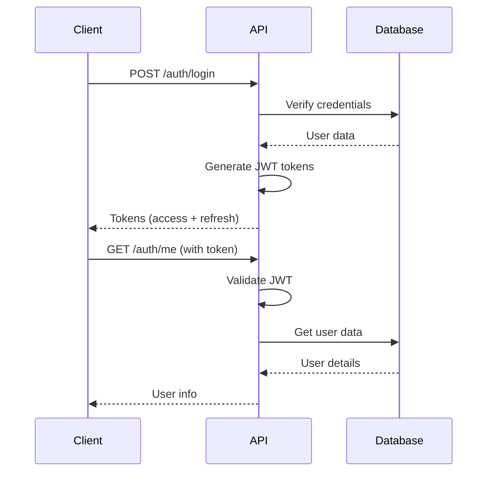

# Authentication & Authorization - Quick Summary

## 🔐 System Overview

This microservice implements **JWT-based authentication** with **role-based access control (RBAC)** providing secure user management and fine-grained permissions.

---

## 🏗️ Architecture

```
Client → FastAPI (Auth Routes) → JWT Middleware → User Service → PostgreSQL
                                       ↓
                                RBAC Permission Check
```

**Tech Stack:**
- JWT tokens (python-jose)
- Bcrypt password hashing (passlib)
- PostgreSQL with asyncpg
- FastAPI with Pydantic validation

---

## 🔑 Key Features

✅ **User Registration & Login**  
✅ **JWT Access & Refresh Tokens**  
✅ **Password Hashing with Bcrypt**  
✅ **Role-Based Access Control (RBAC)**  
✅ **Token Refresh Mechanism**  
✅ **Rate Limiting**  
✅ **Input Validation**  
✅ **SQL Injection Prevention**  

---

## 👥 User Roles

| Role | Level | Permissions |
|------|-------|-------------|
| **admin** | 🔴 Highest | Full system access, user management |
| **user** | 🟡 Standard | Create/read/update own resources |
| **readonly** | 🟢 Limited | Read-only access |

**Admin Bypass:** Admins can access all endpoints regardless of required role.

---

## 🚀 Quick Start

### 1. Login
```bash
curl -X POST http://localhost:8000/api/v1/auth/login \
  -H "Content-Type: application/json" \
  -d '{"username":"admin","password":"Admin123!"}'
```

### 2. Get Access Token
```json
{
  "access_token": "eyJhbGciOiJIUzI1NiIs...",
  "refresh_token": "eyJhbGciOiJIUzI1NiIs...",
  "token_type": "bearer",
  "expires_in": 1800
}
```

### 3. Use Token
```bash
curl -X GET http://localhost:8000/api/v1/auth/me \
  -H "Authorization: Bearer {access_token}"
```

---

## 📋 Default Test Accounts

| Username | Password | Role | Email |
|----------|----------|------|-------|
| admin | Admin123! | admin | admin@example.com |
| testuser | User123! | user | user@example.com |
| readonly | Readonly123! | readonly | readonly@example.com |

**+ 17 fake users** with password: `Password123!`

⚠️ **Change passwords in production!**

---

## 🛡️ Security Features

### Password Security
- **Algorithm:** Bcrypt with automatic salting
- **Requirements:** Min 8 chars, uppercase, lowercase, digit
- **Storage:** Hashed only, never plain text

### Token Security
- **Access Token:** 30 minutes (API access)
- **Refresh Token:** 7 days (token renewal)
- **Algorithm:** HS256 (HMAC-SHA256)
- **Validation:** Signature, expiration, type checking

### Additional Security
- Parameterized SQL queries (no injection)
- Rate limiting (10 req/min per IP)
- Input validation (Pydantic models)
- Secure password hashing (bcrypt)

---

## 📡 Core Endpoints

### Authentication (`/api/v1/auth`)

| Method | Endpoint | Access | Description |
|--------|----------|--------|-------------|
| POST | `/auth/register` | Public | Register new user |
| POST | `/auth/login` | Public | Login with credentials |
| POST | `/auth/refresh` | Public | Refresh access token |
| GET | `/auth/me` | Protected | Get current user |
| POST | `/auth/logout` | Protected | Logout user |

### User Management (`/api/v1/users`)

| Method | Endpoint | Access | Description |
|--------|----------|--------|-------------|
| GET | `/users` | Admin | List all users |
| POST | `/users` | Admin | Create user |
| GET | `/users/{id}` | Self/Admin | Get user details |
| PUT | `/users/{id}` | Self/Admin | Update user |
| DELETE | `/users/{id}` | Admin | Delete user |
| PUT | `/users/{id}/password` | Self | Change password |
| GET | `/users/stats` | Admin | User statistics |

---

## 🔄 Authentication Flow



---

## 🧪 Testing Examples

### Test Login
```bash
curl -X POST http://localhost:8000/api/v1/auth/login \
  -H "Content-Type: application/json" \
  -d '{"username":"admin","password":"Admin123!"}'
```

### Test RBAC (Regular User Cannot List Users)
```bash
# Login as regular user
TOKEN=$(curl -s -X POST http://localhost:8000/api/v1/auth/login \
  -H "Content-Type: application/json" \
  -d '{"username":"testuser","password":"User123!"}' | jq -r '.access_token')

# Try admin endpoint (should fail with 403)
curl -X GET http://localhost:8000/api/v1/users \
  -H "Authorization: Bearer $TOKEN"

# Expected: {"detail":"Insufficient permissions. Required role: admin"}
```

### Test Admin Access
```bash
# Login as admin
ADMIN_TOKEN=$(curl -s -X POST http://localhost:8000/api/v1/auth/login \
  -H "Content-Type: application/json" \
  -d '{"username":"admin","password":"Admin123!"}' | jq -r '.access_token')

# List users (should succeed)
curl -X GET http://localhost:8000/api/v1/users \
  -H "Authorization: Bearer $ADMIN_TOKEN"
```

---

## 📊 Database Schema

```sql
CREATE TABLE users (
    id SERIAL PRIMARY KEY,
    email VARCHAR(255) UNIQUE NOT NULL,
    username VARCHAR(100) UNIQUE NOT NULL,
    full_name VARCHAR(255),
    hashed_password VARCHAR(255) NOT NULL,
    role VARCHAR(20) NOT NULL DEFAULT 'user',
    is_active BOOLEAN NOT NULL DEFAULT true,
    is_verified BOOLEAN NOT NULL DEFAULT false,
    last_login TIMESTAMP WITH TIME ZONE,
    created_at TIMESTAMP WITH TIME ZONE DEFAULT CURRENT_TIMESTAMP,
    updated_at TIMESTAMP WITH TIME ZONE DEFAULT CURRENT_TIMESTAMP
);

-- Indexes
CREATE INDEX idx_users_email ON users(email);
CREATE INDEX idx_users_username ON users(username);
CREATE INDEX idx_users_role ON users(role);
```

---

## 🔍 Debugging

### View Users in Database
```bash
docker exec docker-db-1 sh -c 'PGPASSWORD=labpass psql -U labuser -d labdb -c "SELECT id, email, username, role FROM users;"'
```

### Check API Logs
```bash
docker logs docker-api-1 --tail 50 | grep -i auth
```

### Decode JWT Token (Debug Only)
```python
import jwt
token = "your_token_here"
decoded = jwt.decode(token, options={"verify_signature": False})
print(decoded)
```

---

## ⚠️ Common Issues

| Error | Cause | Solution |
|-------|-------|----------|
| "Could not validate credentials" | Invalid/expired token | Re-login or refresh token |
| "Insufficient permissions" | Wrong user role | Check role with `/auth/me` |
| "Email already exists" | Duplicate registration | Use different email or reset password |
| "Password does not meet requirements" | Weak password | Min 8 chars, uppercase, lowercase, digit |

---

## 🔐 Security Best Practices

### For Production:
1. ✅ Change all default passwords
2. ✅ Use strong SECRET_KEY (32+ random bytes)
3. ✅ Enable HTTPS/TLS only
4. ✅ Implement token blacklist in Redis
5. ✅ Enable CORS with specific origins
6. ✅ Monitor failed login attempts
7. ✅ Regular security audits
8. ✅ Keep dependencies updated

### For Development:
- Never commit `.env` files
- Use different secrets for dev/prod
- Test all auth flows
- Review security changes carefully
- Use security linting tools (bandit)

---

## 📚 Documentation

- **Full Documentation:** [`docs/AUTHENTICATION.md`](./AUTHENTICATION.md)
- **API Docs (Swagger):** http://localhost:8000/docs
- **API Docs (ReDoc):** http://localhost:8000/redoc

---

## 🎯 Implementation Summary

### Files Modified/Created:

**Core Authentication:**
- `/app/core/auth.py` - JWT creation, password hashing
- `/app/core/permissions.py` - RBAC role checking

**API Routes:**
- `/app/api/auth_routes.py` - Authentication endpoints
- `/app/api/user_routes.py` - User management endpoints

**Services:**
- `/app/services/user_service.py` - User business logic
- `/app/services/user_generator.py` - Fake user generation

**Database:**
- `/app/db/init_users.sql` - Users table schema

**Models & Schemas:**
- `/app/models/user.py` - User model and UserRole enum
- `/app/schemas/user.py` - Pydantic validation schemas

**Configuration:**
- `/app/requirements.txt` - Added: python-jose, passlib, email-validator, bcrypt==4.0.1

---

## ✅ Feature Checklist

- [x] User registration with validation
- [x] Password hashing with bcrypt
- [x] JWT token generation (access + refresh)
- [x] Token refresh mechanism
- [x] User login with credentials
- [x] Protected endpoints with JWT
- [x] Role-based access control (RBAC)
- [x] Admin, User, Readonly roles
- [x] Get current user endpoint
- [x] User CRUD operations
- [x] Password change endpoint
- [x] User statistics endpoint
- [x] Input validation with Pydantic
- [x] SQL injection prevention
- [x] Rate limiting
- [x] Default users creation
- [x] Fake users generation
- [x] Comprehensive error handling
- [x] Logging and monitoring
- [x] Interactive API documentation
- [x] Complete test suite

---

## 🚀 Status

**System Status:** ✅ Production Ready  
**Last Updated:** November 20, 2025  
**Version:** 1.0

All authentication and authorization features are fully implemented, tested, and operational.

---

**For detailed implementation details, see:** [`docs/AUTHENTICATION.md`](./AUTHENTICATION.md)
